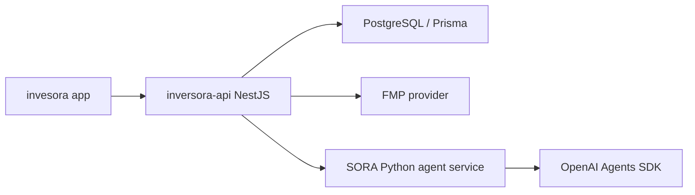

# SORA: agente OpenAI y runtime Python

Este documento define la evolucion de SORA para Inversora: pasar de un endpoint educativo simple en NestJS a un agente interno con tools controladas, memoria conversacional y comparacion explicativa de productos indexados.

## Estado actual

El backend ya incluye `src/modules/assistant/`:

| Pieza            | Estado                                                                                           |
| ---------------- | ------------------------------------------------------------------------------------------------ |
| Endpoint publico | `POST /assistant/explain`                                                                        |
| Endpoint chat    | `POST /assistant/chat` con `sessionId` opcional y hasta 5 fondos seleccionados                   |
| Motor LLM        | OpenAI desde NestJS con Chat Completions o runtime Python segun `ASSISTANT_RUNTIME`              |
| Guardrails       | Rechazo de compra/venta, limpieza de salida y disclaimer                                         |
| Contexto         | Ficha de fondo + Score Inversora para un ISIN; varios fondos en chat para comparativas           |
| Cache            | PostgreSQL para `explain`; `chat` no cachea en MVP por depender de sesion y fondos seleccionados |
| Sesiones         | `assistant_conversations` y `assistant_messages` guardan turns de chat                           |
| Memoria          | `chat` recupera hasta 8 mensajes recientes por `sessionId` y los incluye en el contexto factual  |
| Rate limit       | Limite in-memory por IP o `x-sora-client-id` en endpoints publicos                               |
| Limites actuales | Sin streaming                                                                                    |

Este MVP es correcto para HU educativas puntuales. No basta todavia para "bot general" dentro de la app.

## Decision de arquitectura

Mantener NestJS como backend publico y anadir un runtime Python privado para agentes:



Responsabilidades:

| Capa         | Responsabilidad                                                                           |
| ------------ | ----------------------------------------------------------------------------------------- |
| App          | UI conversacional, estados, feedback del usuario                                          |
| NestJS       | Auth, contratos HTTP, validacion, rate limiting, cache, carga de fondos, Score, auditoria |
| Python agent | Orquestacion con Agents SDK, tools de solo lectura, sesiones, handoffs futuros            |
| OpenAI       | Modelo, Responses API, trazas y ejecucion agentica                                        |

El agente no debe llamar directamente a FMP ni escribir en la base en MVP. NestJS debe enviar un contexto factual minimo y trazable.

## Por que Agents SDK

La documentacion oficial de OpenAI Agents SDK define un `Agent` como un LLM con instrucciones, tools y comportamiento opcional como handoffs, guardrails y salidas estructuradas. El SDK usa Responses API por defecto para modelos OpenAI y permite que `Agent` + `Runner` gestionen turns, tools, guardrails, handoffs y sesiones.

Para Inversora esto encaja mejor que seguir ampliando un prompt plano porque necesitamos:

- Tools de solo lectura para obtener ficha, metricas, score, holdings y comparables.
- Sesiones multi-turno para dudas continuadas en una ficha o comparador.
- Guardrails de input/output y tool guardrails para evitar recomendaciones personalizadas.
- Handoffs futuros entre agente educativo, agente comparador y agente de calidad de datos.
- Trazabilidad por run para depurar respuestas y controlar costes.

Referencias oficiales:

- OpenAI Agents SDK Quickstart: https://openai.github.io/openai-agents-python/quickstart/
- Agents: https://openai.github.io/openai-agents-python/agents/
- Tools: https://openai.github.io/openai-agents-python/tools/
- Sessions: https://openai.github.io/openai-agents-python/sessions/
- Guardrails: https://openai.github.io/openai-agents-python/guardrails/

## Scaffold incluido

Se ha anadido `agent-service/` como primer runtime:

| Archivo                              | Uso                                                     |
| ------------------------------------ | ------------------------------------------------------- |
| `agent-service/pyproject.toml`       | Dependencias FastAPI, Uvicorn y `openai-agents`         |
| `agent-service/app/main.py`          | API interna `GET /health` y `POST /agent/respond`       |
| `agent-service/app/agent.py`         | Wrapper de `Agent` + `Runner` con instrucciones SORA    |
| `agent-service/app/backend_tools.py` | Cliente HTTP para tools read-only de NestJS             |
| `agent-service/app/schemas.py`       | Contrato Pydantic alineado con surfaces actuales        |
| `agent-service/Dockerfile`           | Imagen del runtime Python                               |
| `docker-compose.yml`                 | Servicio opcional `assistant-agent` bajo perfil `agent` |
| `PythonAgentAssistantService`        | Cliente NestJS para invocar `POST /agent/respond`       |

Arranque local:

```powershell
cd agent-service
python -m venv .venv
.\.venv\Scripts\Activate.ps1
python -m pip install -e .
$env:OPENAI_API_KEY = "sk-..."
uvicorn app.main:app --reload --port 8001
```

Arranque con Docker Compose:

```powershell
docker compose --profile agent up assistant-agent
```

## Contrato interno propuesto

`POST /agent/respond`

Request:

```json
{
  "message": "Comparame TER y score de estos fondos",
  "surface": "compare",
  "locale": "es",
  "session_id": "user-123:compare-456",
  "context": {
    "funds": [
      {
        "isin": "IE00B3XXRP09",
        "name": "Vanguard S&P 500 UCITS ETF",
        "ter": 0.07,
        "score": 82
      }
    ]
  }
}
```

Response:

```json
{
  "text": "Respuesta educativa...",
  "source": "openai-agents",
  "model": "gpt-4o-mini"
}
```

En la integracion real NestJS debe seguir devolviendo el contrato publico `AssistantExplainResponse` o crear un nuevo contrato `AssistantChatResponse` con `sessionId`, `citations`, `usedTools` y `safetyFlags`.

## Configuracion NestJS

El runtime de `POST /assistant/explain` y `POST /assistant/chat` se selecciona por entorno:

| Variable                              | Valor                   | Uso                                                                              |
| ------------------------------------- | ----------------------- | -------------------------------------------------------------------------------- |
| `ASSISTANT_RUNTIME`                   | `nestjs`                | Motor actual: OpenAI desde NestJS con Chat Completions. Es el default.           |
| `ASSISTANT_RUNTIME`                   | `python-agent`          | NestJS construye contexto, llama al servicio Python y mantiene cache/guardrails. |
| `ASSISTANT_AGENT_BASE_URL`            | `http://localhost:8001` | Base URL del runtime Python.                                                     |
| `ASSISTANT_AGENT_TIMEOUT_MS`          | `10000`                 | Timeout de la llamada servicio-a-servicio.                                       |
| `ASSISTANT_INTERNAL_API_KEY`          | secreto                 | Token para proteger tools read-only de SORA en NestJS.                           |
| `ASSISTANT_RATE_LIMIT_MAX_REQUESTS`   | `30`                    | Maximo de requests por cliente/ventana en endpoints publicos.                    |
| `ASSISTANT_RATE_LIMIT_WINDOW_SECONDS` | `60`                    | Duracion de la ventana de rate limit.                                            |

Con `ASSISTANT_RUNTIME=python-agent`, NestJS no exige `OPENAI_API_KEY` para arrancar, porque la clave la consume el servicio Python. Si se levanta con Docker Compose, el perfil `agent` pasa `OPENAI_API_KEY` al contenedor desde el entorno local.

Variables del runtime Python para tools:

| Variable                       | Uso                                               |
| ------------------------------ | ------------------------------------------------- |
| `SORA_BACKEND_BASE_URL`        | Base URL de `inversora-api` vista desde Python.   |
| `SORA_INTERNAL_API_KEY`        | Debe coincidir con `ASSISTANT_INTERNAL_API_KEY`.  |
| `SORA_BACKEND_TIMEOUT_SECONDS` | Timeout de llamadas tool -> backend. Default `5`. |

## Endpoint conversacional

`POST /assistant/chat` es la primera superficie de bot para la app. Reutiliza el mismo pipeline seguro que `explain`, pero acepta contexto conversacional:

```json
{
  "surface": "compare",
  "message": "Compara estos fondos para entender sus diferencias",
  "sessionId": "user-123:compare-sp500",
  "funds": [{ "isin": "US78462F1030" }, { "isin": "US46090E1038" }],
  "locale": "es"
}
```

Respuesta:

```json
{
  "title": "Como comparar fondos en Inversora",
  "text": "Respuesta educativa...",
  "source": "openai",
  "cached": false,
  "sessionId": "user-123:compare-sp500",
  "promptVersion": "sora-v1",
  "disclaimer": "Inversora no ofrece asesoramiento financiero personalizado..."
}
```

La respuesta de chat no se cachea en el MVP porque puede depender de varios fondos seleccionados y del estado de sesion. El context builder ya construye `context.funds[]` con ISIN, nombre, benchmark, TER y Score Inversora cuando los fondos existen en la base.

Cada turn de chat se persiste en PostgreSQL:

| Tabla                     | Uso                                                                                         |
| ------------------------- | ------------------------------------------------------------------------------------------- |
| `assistant_conversations` | Envelope por `sessionId`, surface, locale y ultima actividad                                |
| `assistant_messages`      | Mensajes `user` y `assistant`, intent, runtime, source, prompt version e ISINs relacionados |

Si el cliente no manda `sessionId`, NestJS genera uno con prefijo `sora_` y lo devuelve para que la app pueda continuar la conversacion.

Cuando el cliente manda un `sessionId` existente, NestJS recupera hasta 8 mensajes recientes y los incluye como `context.recentMessages[]` antes de invocar el runtime configurado. Esta memoria es deliberadamente corta para controlar coste y reducir riesgo de arrastrar contexto irrelevante.

## Tools que necesita el backend

Primera fase, solo lectura:

| Tool Python                  | Implementacion real en NestJS               | Estado   | Valor de producto                                   |
| ---------------------------- | ------------------------------------------- | -------- | --------------------------------------------------- |
| `get_fund_snapshot(isin)`    | `FundsRepository.findByIsin` + DTO publico  | Hecho    | Responder dudas sobre una ficha                     |
| `get_score_breakdown(isin)`  | `ScoringService.calculateScoreForFundId`    | Hecho    | Explicar por que un fondo puntua asi                |
| `compare_funds(isins[])`     | Query agregada de fondos + scoring          | Hecho    | Comparativas educativas                             |
| `validate_comparison_fairness(isins[])` | Reglas RN-02 en NestJS           | Hecho    | Avisar comparativas no homogeneas                   |
| `get_glossary_term(term)`    | `GlossaryService.lookup`                    | Hecho    | Respuestas instantaneas y baratas                   |
| `get_dataset_freshness()`    | Metadatos de sync FMP                       | Pendiente | Decir si los datos estan actualizados               |
| `get_holdings_summary(isin)` | Futuro modulo de composicion FMP            | Pendiente | Explicar exposicion cuando exista plan FMP adecuado |

Patron recomendado: el agente llama tools HTTP internas expuestas por NestJS, con token servicio-a-servicio y timeout corto. Asi Python no duplica reglas de negocio ni acceso a datos.

Endpoints disponibles:

| Endpoint                                             | Uso                                                               |
| ---------------------------------------------------- | ----------------------------------------------------------------- |
| `GET /internal/assistant/tools/funds/:isin/snapshot` | Snapshot educativo de un fondo visible: perfil, metricas y Score. |
| `GET /internal/assistant/tools/funds/:isin/score-breakdown` | Desglose del Score Inversora para explicaciones educativas. |
| `POST /internal/assistant/tools/funds/compare`       | Snapshots de hasta 5 fondos para comparativa educativa.           |
| `POST /internal/assistant/tools/funds/validate-comparison` | Valida homogeneidad de benchmark, divisa y vehiculo.        |
| `GET /internal/assistant/tools/glossary/:term`       | Termino del glosario educativo estatico.                          |

Ambos requieren `X-Sora-Internal-Api-Key` o `Authorization: Bearer <token>`.

## Rate limit

Los endpoints publicos `POST /assistant/explain` y `POST /assistant/chat` usan un rate limiter in-memory para proteger coste y abuso accidental. La clave del limite se calcula asi:

1. `x-sora-client-id` si la app lo envia.
2. Primera IP de `x-forwarded-for`.
3. `request.ip`.

Cuando se supera el limite, la API devuelve `429 Too Many Requests`. Para produccion multi-instancia, este limiter deberia moverse a Redis o al API gateway.

## Backlog backend

1. Anadir limites de tokens por request y presupuesto diario por entorno.
2. Anadir evaluaciones: preguntas prohibidas, explicacion de TER, comparativa de fondos, falta de datos, freshness del dataset.
3. Incorporar streaming cuando la app tenga UI de chat estable.
4. Integrar trazas de OpenAI y logs con `requestId`, `sessionId`, `userId` anonimizado y `promptVersion`.
5. Mantener modo mock para tests y CI sin llamar a OpenAI.

## Riesgos y controles

| Riesgo                           | Control                                                                           |
| -------------------------------- | --------------------------------------------------------------------------------- |
| Consejo financiero personalizado | Guardrails en NestJS, prompt, output guardrails y tests negativos                 |
| Alucinacion de datos             | Contexto JSON cerrado, tools read-only, citas de campos usados                    |
| Coste excesivo                   | Cache, modelo barato por defecto, rate limits, trazas y max tokens                |
| Latencia                         | Timeouts, fallback a glossary/cache, streaming futuro                             |
| Duplicacion de dominio           | Python solo orquesta; NestJS conserva reglas y datos                              |
| Datos FMP incompletos por plan   | El agente debe informar falta de holdings/historico cuando no esten sincronizados |

## Relacion con FMP

El agente debe explotar el dataset FMP solo a traves del backend. Para el MVP actual puede explicar TER, benchmark, score y ficha basica. Cuando se habiliten endpoints de composicion, historicos largos y holdings, SORA podra:

- Explicar concentracion sectorial/geografica.
- Comparar exposicion de dos fondos.
- Avisar si un fondo no tiene suficiente historial.
- Resumir diferencias entre ETF, mutual fund y clase de acumulacion/distribucion si el dataset lo soporta.
- Detectar que una comparativa no es justa por benchmark, divisa, domicilio o cobertura diferente.

La integracion MCP de FMP es util para desarrollo y exploracion, pero no debe ser la fuente directa del producto en produccion. La fuente productiva debe seguir siendo el sync controlado de `providers` + `funds`.
