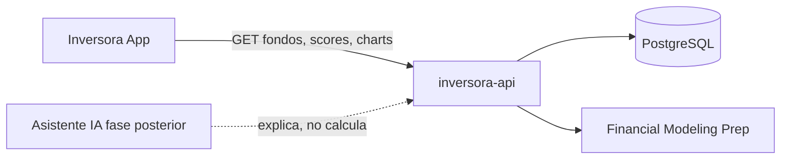

# Propósito y alcance de Inversora API

## Qué es

**Inversora API** es el backend de datos y scoring de [Inversora](https://github.com/): una aplicación educativa que ayuda a principiantes a **explorar, entender y comparar fondos indexados** sin ejecutar inversiones ni ofrecer asesoramiento personalizado.

La API cumple tres funciones principales en el MVP:

1. **Catálogo** — Exponer fondos indexados validados con metadatos, métricas y estado de calidad de datos.
2. **Scoring** — Calcular y persistir el Score Inversora de forma determinista, trazable y auditable.
3. **Datos de mercado** — Sincronizar precios históricos, composición y exposición desde proveedores externos (hoy Financial Modeling Prep).

El principio rector del producto es *educar primero, comparar después*. La API provee los datos objetivos; la app los presenta con contexto educativo y avisos legales.

## Qué no es (MVP)

| Inversora API es | Inversora API no es |
|------------------|---------------------|
| Fuente de verdad de fondos, métricas y scores | Broker, roboadvisor ni ejecutor de órdenes |
| Servicio de lectura HTTP para la app móvil/web | Gestor de usuarios, cuentas o sesiones |
| Motor de scoring en servidor | Generador de recomendaciones de compra/venta |
| Sincronizador de datos de mercado | Custodio de carteras ni favoritos del usuario |

Los **favoritos**, el **perfil educativo** y la **calculadora** viven en el cliente (almacenamiento local). No requieren backend en el MVP.

El **Asistente Inversora** (IA explicativa) es una fase posterior: explicará los datos que ya calcula esta API, pero **no recalculará ni modificará** scores ni rankings.

## Ecosistema

| Componente | Repositorio / ubicación | Rol |
|------------|-------------------------|-----|
| App Inversora | `invesora` | UI, favoritos locales, calculadora, avisos legales |
| inversora-api | este repositorio | Datos, sync, scoring, contrato HTTP |
| PostgreSQL | Docker local / DB gestionada | Persistencia de fondos, precios y composición |
| FMP | `src/modules/providers/` | Datos de mercado externos (mock o live) |

## Backend oficial

**NestJS + PostgreSQL + Prisma** es la arquitectura canónica del backend de Inversora.

La app móvil integrará esta API reemplazando los mocks en:

- `src/features/funds/services/get-funds.ts`
- `src/features/funds/services/get-fund-by-isin.ts`
- `src/features/funds/services/get-rankings.ts`

Si la documentación de la app menciona Supabase Edge Functions como backend planificado, considérelo **obsoleto**: el servicio HTTP de este repositorio es la referencia de implementación.

## Mapeo pantalla app → responsabilidad API

| Pantalla / flujo (app) | Datos que necesita | Responsabilidad API |
|------------------------|-------------------|---------------------|
| Dashboard `/` | Destacados, ranking teaser, búsqueda | Catálogo filtrado, rankings por benchmark, scores |
| Catálogo `/funds` | Lista con score, rank, filtros | `GET /funds` con paginación, orden y filtros |
| Ficha `/funds/[isin]` | Detalle, score, gráfico, exposición | Detalle por fondo, chart, holdings, exposure, score |
| Comparador `/compare` | Dos fondos lado a lado | Misma ficha × 2 (cliente orquesta) |
| Favoritos `/favorites` | ISINs guardados localmente | **Sin API** en MVP |
| Calculadora `/calculator` | Inputs de aportación y horizonte | **Sin API** en MVP |

## Alcance funcional del MVP (backend)

### Incluido

- Health check y documentación OpenAPI (Swagger).
- Sincronización de fondos indexados desde FMP (metadata + precios EOD).
- Endpoints de lectura: listado, detalle, gráfico histórico, holdings, exposición sectorial y geográfica, score.
- Cálculo y persistencia del Score Inversora con recálculo automático tras el sync diario.
- Validación de configuración con Zod (`src/shared/config/env.schema.ts`).
- Tests unitarios, de integración (PostgreSQL + Prisma + FMP mock) y E2E en CI.

### Planificado (próximas fases)

- Sincronización de composición (holdings y allocations) en el pipeline diario.
- Contrato orientado a la app (`GET /funds/:isin` agregado, rankings por benchmark).
- Integración real de la app móvil (sustitución de mocks).
- Staging y producción con FMP live y scheduler activo.
- Servicio de asistente IA separado (fase 3).

### Excluido del MVP

- Autenticación, registro y cuentas de usuario.
- Watchlists, carteras y alertas personalizadas.
- Órdenes de compra/venta y conexión con brokers.
- ETFs/acciones/cripto fuera del catálogo de fondos indexados.
- Panel de administración avanzado (“Clínica de Datos”).

## Criterios de éxito (backend MVP)

- La app puede listar fondos reales con score y filtros sin mocks locales.
- Cada fondo visible tiene metadata, precios históricos y un score calculado en servidor.
- El scoring es reproducible: misma entrada → mismo score, con versión de modelo documentada.
- Un desarrollador nuevo arranca el entorno local en menos de 15 minutos siguiendo el README.
- CI en `main` pasa lint, build, tests unitarios, integración y E2E.

## Ver también

- [roles-and-responsibilities.md](./roles-and-responsibilities.md) — capas y módulos internos
- [infrastructure-phases.md](./infrastructure-phases.md) — evolución del despliegue
- [scoring-algorithm.md](./scoring-algorithm.md) — implementación actual del score
- `invesora/docs/product/mvp-scope.md` — alcance completo del producto
- `invesora/docs/product/scoring.md` — reglas de negocio RN-02 a RN-05
