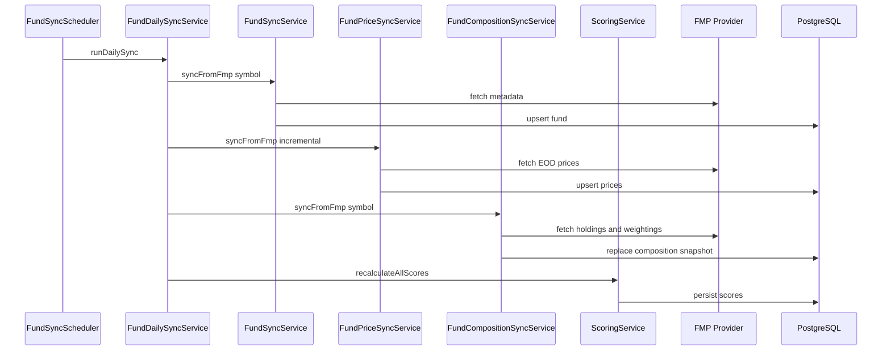

# Roles y responsabilidades

Este documento describe los **roles** implicados en Inversora API en tres niveles: actores del ecosistema, capas internas del código y ownership del equipo.

## Actores del ecosistema

| Actor | Rol | Ubicación |
|-------|-----|-----------|
| **App Inversora** | Presentación, navegación, favoritos locales, calculadora, avisos legales | Repositorio `invesora` |
| **inversora-api** | Datos de fondos, sincronización, scoring, contrato HTTP | Este repositorio |
| **PostgreSQL** | Persistencia de fondos, precios, holdings y allocations | Docker Compose local / DB gestionada en cloud |
| **FMP Provider** | Fuente externa de datos de mercado (ETF info, precios EOD) | `src/modules/providers/financial-modeling-prep/` |
| **GitHub Actions** | CI/CD: lint, build, tests unitarios, integración y E2E | `.github/workflows/` |

### Reglas de interacción

- La **app solo lee** la API; no calcula scores en producción.
- La **API no conoce** favoritos ni perfil educativo del usuario.
- El **proveedor FMP** nunca se expone directamente al cliente; siempre pasa por normalizers y fixtures.
- El **asistente IA** (fase posterior) explicará datos ya calculados; no alterará rankings ni scores.

## Capas internas de la API

Arquitectura semi-hexagonal basada en NestJS. Cada capa tiene una responsabilidad única:

| Capa | Responsabilidad | Ubicación típica |
|------|-----------------|------------------|
| **Controller** | Routing HTTP, parámetros de query, decoradores Swagger | `src/modules/*/controllers/` |
| **Service** | Lógica de negocio, orquestación de casos de uso | `src/modules/*/services/` |
| **Repository** | Acceso a datos vía Prisma; sin lógica de negocio | `src/modules/*/repositories/` |
| **Provider** | Integraciones con sistemas externos (FMP) | `src/modules/providers/` |
| **Entity / Schema / Mapper** | Contratos Zod, tipos inferidos, transformaciones dominio ↔ persistencia | `src/modules/*/entities/` |
| **DTO** | Contratos de respuesta HTTP documentados en OpenAPI | `src/modules/*/dto/` |
| **Scheduler** | Tareas programadas (sync diario de fondos) | `src/modules/*/schedulers/` |
| **Shared** | Configuración, cliente HTTP, Prisma, Swagger | `src/shared/` |

### Ejemplos en el código actual

| Capa | Archivo de referencia |
|------|----------------------|
| Controller | `src/modules/funds/controllers/funds.controller.ts` |
| Service | `src/modules/funds/services/fund-daily-sync.service.ts` |
| Repository | `src/modules/funds/repositories/funds.repository.ts` |
| Provider | `src/modules/providers/financial-modeling-prep/financial-modeling-prep.provider.ts` |
| Entity / Schema | `src/modules/funds/entities/fund.schema.ts` |
| Scheduler | `src/modules/funds/schedulers/fund-sync.scheduler.ts` |
| Config | `src/shared/config/env.schema.ts` |

### Flujo de una petición HTTP

```text
Cliente HTTP
    → Controller (valida params, delega)
        → Service (lógica de negocio)
            → Repository (consulta Prisma)  o  Provider (consulta FMP)
                → Entity/Mapper (transforma a contrato de dominio)
            ← resultado tipado
        ← DTO de respuesta
    ← JSON HTTP
```

**Regla:** los controllers son finos. Toda lógica de negocio vive en services.

## Módulos de dominio

| Módulo | Responsabilidad | Depende de |
|--------|-----------------|------------|
| `health` | Liveness (`GET /health`) | — |
| `providers` | Cliente FMP, normalizers, fixtures mock/live | `shared/http`, `shared/config` |
| `funds` | Lectura de catálogo, sync de metadata y precios, composición, exposición | `providers`, `shared/database` |
| `scoring` | Cálculo del Score Inversora, persistencia, endpoint `GET /funds/:id/score` | `funds` |
| `shared` | Configuración Zod, Prisma, cliente HTTP con reintentos, Swagger | — |

### Registro en AppModule

Los módulos se importan en `src/app.module.ts`. `main.ts` solo arranca la aplicación y configura Swagger; no contiene lógica de dominio.

```text
AppModule
  ├── AppConfigModule      (env validado)
  ├── ScheduleModule       (cron jobs)
  ├── HttpClientModule     (axios + reintentos)
  ├── PrismaModule         (conexión DB)
  ├── ProvidersModule      (FMP)
  ├── FundsModule          (dominio principal)
  ├── ScoringModule        (score)
  └── HealthModule         (liveness)
```

## Flujo de sincronización diaria

El pipeline de datos es responsabilidad del módulo `funds`, orquestado por `FundDailySyncService`:



| Paso | Responsable | Resultado |
|------|-------------|-----------|
| 1. Metadata del fondo | `FundSyncService` | Fila en tabla `funds` |
| 2. Precios históricos | `FundPriceSyncService` | Filas en `fund_prices` |
| 3. Recálculo de scores | `ScoringService` | Campo `score` actualizado en `funds` |
| 4. Composición | `FundCompositionSyncService` → `FundCompositionService` | Filas en `fund_holdings` y `fund_allocations` |

El scheduler (`FundSyncScheduler`) está desactivado por defecto (`SYNC_SCHEDULER_ENABLED=false`). En desarrollo local, el sync se dispara manualmente o se activa el cron en `.env`.

## Endpoints públicos actuales

| Método | Ruta | Módulo | Descripción |
|--------|------|--------|-------------|
| `GET` | `/health` | health | Estado del servicio |
| `GET` | `/funds` | funds | Listado paginado con filtros y orden |
| `GET` | `/funds/:id` | funds | Detalle de un fondo |
| `GET` | `/funds/:id/chart` | funds | Serie histórica indexada |
| `GET` | `/funds/:id/holdings` | funds | Posiciones del portfolio |
| `GET` | `/funds/:id/exposure/countries` | funds | Exposición geográfica |
| `GET` | `/funds/:id/exposure/sectors` | funds | Exposición sectorial |
| `GET` | `/funds/:id/score` | scoring | Score Inversora con desglose |
| `GET` | `/api/docs` | shared | Swagger UI |

Documentación interactiva completa en `http://localhost:3000/api/docs` con la API en marcha.

## Ownership del equipo

| Rol del equipo | Responsabilidad en la API |
|----------------|---------------------------|
| **Backend** | Módulos, sync, scoring, contrato HTTP, Prisma schema |
| **Mobile / frontend** | Consumo del contrato, sustitución de mocks, UI educativa |
| **Producto** | Reglas RN de scoring, criterios de visibilidad, destacados trimestre |
| **DevOps / CI** | Workflows GitHub Actions, entornos, variables de despliegue |

### Al abrir una nueva fase

1. **Producto** define el requisito y las reglas de negocio (p. ej. nueva categoría de exposición).
2. **Backend** diseña el módulo o endpoint, actualiza schema Prisma si aplica, y documenta en `docs/`.
3. **Mobile** adapta los servicios de la app al nuevo contrato.
4. **DevOps** actualiza entornos y CI si hay nuevas dependencias (env vars, servicios).

## Ver también

- [purpose-and-scope.md](./purpose-and-scope.md) — qué hace y qué no hace la API
- [infrastructure-phases.md](./infrastructure-phases.md) — evolución del despliegue por fases
- [development-guide.md](./development-guide.md) — cómo añadir módulos y endpoints
- `invesora/docs/architecture/adr-001-domain-boundaries.md` — límites scoring / favoritos / asistente
